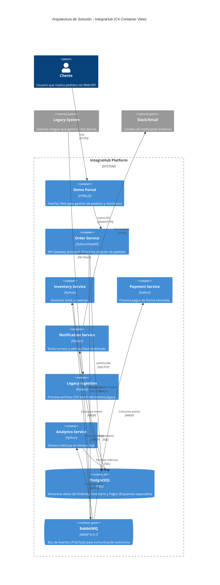

# Informe Técnico Final - Proyecto de Integración "IntegraHub"

## Información del Equipo

**Integrantes:**

- Tony Chen
- Carlos Larco
- Julian Flores
- Fernando Camacho

---

## 1. Visión General del Proyecto

### 1.1 Contexto

**IntegraHub** surge como solución tecnológica para una empresa mediana de retail en expansión que enfrenta el desafío de unificar sistemas heterogéneos (legados y modernos). El negocio requiere procesar pedidos de manera eficiente, integrando canales digitales, gestión de inventario, pasarelas de pago y sistemas de notificación, garantizando que ninguna orden se pierda y que la información fluya correctamente entre departamentos.

### 1.2 Objetivo General

Diseñar e implementar una plataforma de integración empresarial robusta, escalable y resiliente, que orqueste el flujo **Order-to-Cash** completo. La solución prioriza la **Arquitectura Orientada a Eventos (EDA)** y el desacoplamiento de servicios para asegurar alta disponibilidad y mantenibilidad.

---

## 2. Arquitectura del Sistema

La solución adopta un enfoque de **Microservicios** implementados bajo **Arquitectura Hexagonal (Ports & Adapters)**. Este diseño permite aislar la lógica de negocio (el "núcleo") de las tecnologías externas (bases de datos, APIs, colas de mensajería).

### 2.1 Diagrama de Componentes (Nivel Alto)

El sistema se compone de servicios autónomos comunicados híbridamente:

| Servicio                     | Responsabilidad Principal                                                             | Tecnologías Clave            |
| :--------------------------- | :------------------------------------------------------------------------------------ | :--------------------------- |
| **Order Service**            | Punto de entrada (API Gateway lógico). Recibe pedidos y orquesta el inicio del flujo. | Python (FastAPI), PostgreSQL |
| **Inventory Service**        | Gestión de stock. Valida disponibilidad y reserva productos ante eventos de orden.    | Python, PostgreSQL           |
| **Payment Service**          | Procesamiento de transacciones financieras.                                           | Python, Integración Simulada |
| **Notification Service**     | Distribución de alertas (Slack, Email) basada en eventos de dominio.                  | Python, SMTP/Webhooks        |
| **Legacy Ingestion Service** | Integración con sistemas antiguos mediante carga de archivos planos (Batch).          | Python, File Watcher         |
| **Analytics Service**        | Motor de inteligencia de negocios en tiempo real.                                     | Python, Pandas               |
| **RabbitMQ**                 | **Backbone de mensajería.** Maneja la comunicación asíncrona entre servicios.         | AMQP 0-9-1                   |
| **Demo Portal**              | Frontend ligero para visualización y control del sistema.                             | HTML/JS                      |

### 2.2 Decisiones Arquitectónicas

- **Database per Service:** Cada microservicio gestiona su propio esquema de base de datos (o tablas) para evitar acoplamiento a nivel de datos. Se utiliza un único contenedor de PostgreSQL con múltiples bases de datos lógicas/esquemas.
- **Event-Driven Architecture (EDA):** Se prioriza la comunicación asíncrona para operaciones de escritura/procesamiento pesado, mejorando la latencia percibida por el usuario final.

### 2.3 Diagrama de Arquitectura (C4 Container)



---

## 3. Análisis de Flujos y Sincronía

A continuación se detalla qué procesos son síncronos (bloqueantes/inmediatos) y cuáles son asíncronos (diferidos/basados en eventos).

### 3.1 Flujo A: Creación de Pedido (Order-to-Cash)

| Paso | Acción                        | Tipo                | Descripción Técnica                                                                                                  |
| :--- | :---------------------------- | :------------------ | :------------------------------------------------------------------------------------------------------------------- |
| 1    | Cliente -> `POST /orders`     | **Síncrono (HTTP)** | El cliente envía la solicitud al API. Se hacen validaciones básicas (schema, auth).                                  |
| 2    | Order Service -> DB           | **Síncrono**        | Se guarda la orden en estado `PENDING`.                                                                              |
| 3    | Order Service -> RabbitMQ     | **Asíncrono**       | Se publica el evento `OrderCreated` al Exchange `orders`. El API responde `201 Created` al cliente inmediatamente.   |
| 4    | RabbitMQ -> Inventory Service | **Asíncrono**       | Inventory consume el mensaje, valida stock y actualiza su DB local. Publica `InventoryReserved` o `InventoryFailed`. |
| 5    | RabbitMQ -> Payment Service   | **Asíncrono**       | Payment consume el mensaje (tras reserva exitosa), procesa el cobro y publica `PaymentProcessed`.                    |
| 6    | RabbitMQ -> Order Service     | **Asíncrono**       | Order Service escucha los resultados finales y actualiza el estado a `CONFIRMED` o `REJECTED`.                       |

### 3.2 Flujo C: Integración Legacy (Batch)

| Paso | Acción                              | Tipo                 | Descripción Técnica                                                                       |
| :--- | :---------------------------------- | :------------------- | :---------------------------------------------------------------------------------------- |
| 1    | Sistema Externo -> Carpeta `/inbox` | **Asíncrono (I/O)**  | Depósito de archivo CSV con catálogo diario.                                              |
| 2    | Legacy Service -> Detección         | **Event-Based**      | Un `FileMonitor` detecta el evento de creación de archivo `IN_CREATE`.                    |
| 3    | Legacy Service -> Procesamiento     | **Síncrono (Batch)** | Se lee el archivo línea por línea, se transforma a objetos de dominio y se inserta en DB. |

---

## 4. Patrones de Integración Implementados

Hemos aplicado rigurosamente los Patrones de Integración Empresarial (EIP):

### 4.1 Messaging Patterns

1.  **Publish-Subscribe Channel:**
    - **Uso:** Distribución del evento `OrderCreated`.
    - **Detalle:** RabbitMQ Fanout/Topic Exchange. El mensaje es recibido simultáneamente por _Inventory_, _Notification_ y _Analytics_.
2.  **Point-to-Point (Queue):**
    - **Uso:** Comandos específicos donde solo un consumidor debe procesar la tarea (ej. procesamiento de pagos críticos).
3.  **Message Translator:**
    - **Uso:** Dentro de cada adaptador de infraestructura (Consumer).
    - **Detalle:** Transforma el payload JSON crudo de RabbitMQ en objetos de Dominio (Modelos Pydantic/Data Classes) internos del hexágono.
4.  **Dead Letter Channel (DLQ):**
    - **Uso:** Manejo de fallos no recuperables.
    - **Detalle:** Si un mensaje falla tras N reintentos, se mueve automáticamente a una cola `dlq` para inspección manual, evitando que se pierda o bloquee el procesamiento.

### 4.2 Patrones de Resiliencia y Estabilidad

5.  **Idempotent Consumer:**
    - **Implementación:** Se utiliza una clave de idempotencia (`Idempotency-Key` en headers o `message_id` en eventos).
    - **Mecanismo:** Antes de procesar un pago o crear una orden, se consulta al repositorio si esa clave ya fue procesada. Si existe, se ignora el mensaje duplicado.
6.  **Circuit Breaker (Concepto):**
    - **Uso:** En llamadas a servicios externos inestables (simulados). Si fallan repetidamente, el circuito se "abre" para retornar error inmediato sin esperar timeout.

### 4.3 Mapeo de Patrones en el Diagrama

Para facilitar la lectura del diagrama de arquitectura (Sección 2.3), aquí se indica dónde reside visualmente cada patrón:

| Patrón | Ubicación en el Diagrama C4 |
| :--- | :--- |
| **Publish-Subscribe** | Se visualiza en el componente `RabbitMQ` y las múltiples flechas salientes ("Fanout") hacia `Inventory`, `Notification` y `Analytics`. |
| **Point-to-Point** | Representado por la relación exclusiva entre `RabbitMQ` y `Payment Service` (indica una cola de trabajo directo). |
| **Message Translator** | Ocurre **internamente** en los contenedores consumidores (`Inventory`, `Payment`, `Notification`) al recibir el mensaje de la flecha `AMQP`. |
| **Event-Driven consumer** | Todos los servicios que reciben una flecha desde `RabbitMQ` (`Inventory`, `Analytics`, etc.) actúan como consumidores de eventos. |
| **Shared Database (Antipatrón evitado)** | Nótese que aunque `PostgreSQL` es un solo contenedorDb, el diagrama indica "Esquemas separados", evitando que los servicios compartan tablas directamente. |

---

## 5. Implementación de Seguridad (OAuth2 + JWT)

La seguridad se ha diseñado para proteger los recursos críticos del sistema, garantizando que solo clientes autenticados puedan generar pedidos.

### 5.1 Mecanismo de Autenticación

- **Estándar:** OAuth2 con Bearer Tokens (JWT - JSON Web Tokens).
- **Algoritmo:** HS256 (HMAC con SHA-256).

### 5.2 Flujo de Validación

1.  **Generación:** En un flujo real, un Identity Provider emitiría el token. Para efectos demo, se dispone de un script o endpoint para generar tokens válidos de prueba.
2.  **Intercepción:** El `Order Service` cuenta con un **Middleware de Seguridad** (`verify_token` en `shared/infrastructure/security.py`).
3.  **Verificación:**
    - Se extrae el header `Authorization: Bearer <token>`.
    - Se decodifica la firma usando la clave secreta `JWT_SECRET`.
    - Se valida la expiración (`exp`) y la integridad.
4.  **Resultado:** Si es válido, la petición pasa al Dominio. Si es inválido/expirado, se rechaza con `401 Unauthorized`.

---

## 6. Guía de Despliegue y Ejecución

Instrucciones paso a paso para levantar el entorno completo "tipo deploy".

### Requisitos Previos

- Docker Engine instalado.
- Docker Compose V2.

### Pasos para Levantar

1.  **Clonar/Ubicarse en el proyecto:**
    Navegar a la carpeta raíz `IntegraHub`.

2.  **Construir y Ejecutar:**
    Este comando descarga las imágenes base (Python, Postgres, RabbitMQ) y construye los contenedores de los microservicios.

    ```bash
    docker-compose up -d --build
    ```

3.  **Verificar Estado:**
    Comprobar que todos los contenedores estén en estado `Up` o `Healthy`.

    ```bash
    docker ps
    ```

4.  **Inicialización de Datos:**
    El contenedor de base de datos ejecuta automáticamente el script `init-multiple-dbs.sh` al inicio para crear las bases de datos requeridas (`order_db`, `inventory_db`, etc.).

### Acceso a las Interfaces

- **Demo Portal (Frontend):** `http://localhost:8080/` (o abrir `index.html` en el navegador si se sirve estáticamente).
- **Order API (Swagger UI):** `http://localhost:8000/docs`
- **RabbitMQ Management:** `http://localhost:15672` (User: `guest`, Pass: `guest`)

---

## 7. Conclusiones y Recomendaciones

### 7.1 Conclusiones por Integrante

**Tony Chen:**

> _"La mayor lección fue entender la complejidad de la consistencia en sistemas distribuidos. Al implementar el flujo de Order-to-Cash, evidencié que las transacciones ACID de una sola base de datos no aplican aquí. El uso de patrones como Saga (coreografía) fue esencial para sincronizar los estados entre Order, Inventory y Payment. Aprendí que diseñar pensando en consistencia eventual requiere un cambio de mentalidad fundamental respecto al desarrollo monolítico tradicional."_

**Carlos Larco:**

> _"Me centré en la resiliencia y el manejo de fallos. Implementar Dead Letter Queues (DLQ) y estrategias de Retries me enseñó que en integración de sistemas, 'asumir que todo puede fallar' es la regla de oro. Ver cómo el sistema podía recuperarse automáticamente de fallos transitorios en el servicio de pagos o inventario sin perder datos fue una demostración práctica de por qué estos patrones son obligatorios en la industria."_

**Julian Flores:**

> _"La Arquitectura Hexagonal fue el punto clave de mi aprendizaje. Al principio parecía 'sobre-ingeniería', pero al desarrollar los adaptadores pude ver su valor real: desarrollamos la lógica de negocio sin preocuparnos por si usábamos RabbitMQ, Kafka o una API REST. Esta separación de responsabilidades facilitó enormemente las pruebas y me dio una visión clara de cómo construir software mantenible y agnóstico a la infraestructura."_

**Fernando Camacho:**

> _"En un entorno asíncrono donde un pedido 'viaja' por múltiples colas y servicios, perder el control es fácil. Mi conclusión principal gira en torno a la Observabilidad. La implementación de Correlation IDs y claves de idempotencia no fue solo un requisito técnico, sino la única forma viable de depurar y entender qué pasaba en el flujo E2E. Sin trazabilidad, operar microservicios a escala sería imposible."_

### 7.2 Recomendaciones por Integrante

**Tony Chen:**

> _"Recomiendo encarecidamente adoptar Infraestructura como Código (IaC) con herramientas como Terraform para futuras fases. Actualmente dependemos de que los contenedores creen las colas al iniciar, lo cual genera condiciones de carrera. Definir la infraestructura de forma declarativa y versionada nos daría un entorno mucho más predecible y profesional, especialmente si planeamos migrar a la nube."_

**Carlos Larco:**

> _"La gestión de secretos con archivos .env distribuidos es un riesgo de seguridad que no escalará. Mi recomendación es integrar un servidor de configuración centralizada como HashiCorp Vault o Consul. Esto no solo mejoraría la seguridad al rotar secretos dinámicamente, sino que permitiría cambiar configuraciones (como toggles de features) sin tener que redeployar los servicios."_

**Julian Flores:**

> _"Para evitar que los servicios se rompan entre sí cuando alguien cambia una API, deberíamos implementar Contract Testing (ej. con Pact). Aunque documentamos con Swagger, no hay nada que impida que el productor cambie un campo y rompa al consumidor. Pruebas de contrato automatizadas en el CI/CD serían el siguiente paso lógico para garantizar la estabilidad de las interfaces."_

**Fernando Camacho:**

> _"El sistema necesita avanzar hacia una Observabilidad completa. Recomiendo implementar el stack ELK (Elasticsearch, Logstash, Kibana) o Prometheus con Grafana. Ver logs dispersos en contenedores es doloroso; tener un dashboard centralizado que correlacione logs, métricas y trazas distribuidas nos permitiría detectar cuellos de botella y errores de negocio en tiempo real, no solo post-mortem."_
